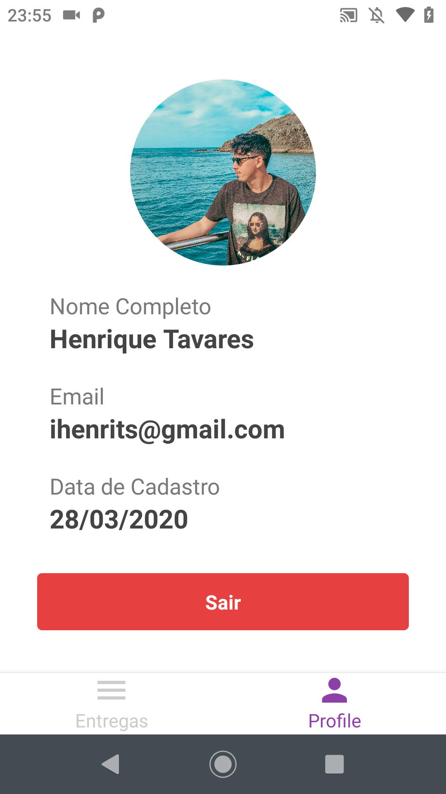

<h1 align="center">
  
</h1>

  
  

  <a href="#truck-project">💻 Project</a>&nbsp;&nbsp;&nbsp;|&nbsp;&nbsp;&nbsp;
  <a href="#camera-images">📷 Images</a>&nbsp;&nbsp;&nbsp;|&nbsp;&nbsp;&nbsp;
  <a href="#computer-author">💻 Author</a>

  FastFeet is an application for a fictional transportation company during Rocketseat's Bootcamp. This project is part of the Bootcamp certification of Rocketseat 10.0. Its API was developed using NodeJS with Express, its web interface was developed using ReactJS and its mobile application was developed using React Native.

---

## :truck: Project

<h1>
  <a href="https://github.com/tavareshenrique/fastfeet-api" style="text-decoration: none;" >
  💾 FastFeet API(NodeJS) ✔️
  </a>
</h1>

<h1>
   <a href="https://github.com/tavareshenrique/fastfeet-web" style="text-decoration: none;">
  ⚛️ FastFeet Web(ReactJS) ✔️
  </a>
</h1>

<h1>
  <a href="https://github.com/tavareshenrique/fastfeet-app" style="text-decoration: none;">
  📱 FastFeet App Mobile(React Native) ✔️
  </a>
</h1>

---

## :camera: Images

<h1 align="center">
  
  
</h1>

<h1 align="center">
  
  

</h1>

---

## :computer: Author

<table>
  <tr>
    <td align="center">
      <a href="http://github.com/tavareshenrique/">
        
         
        
          <b>Henrique Tavares</b>
        
       </a>
        
       <a href="https://github.com/tavareshenrique/fastfeet/commits?author=tavareshenrique" title="Code">@tavareshenrique</a>
    </td>
  </tr>
</table>
